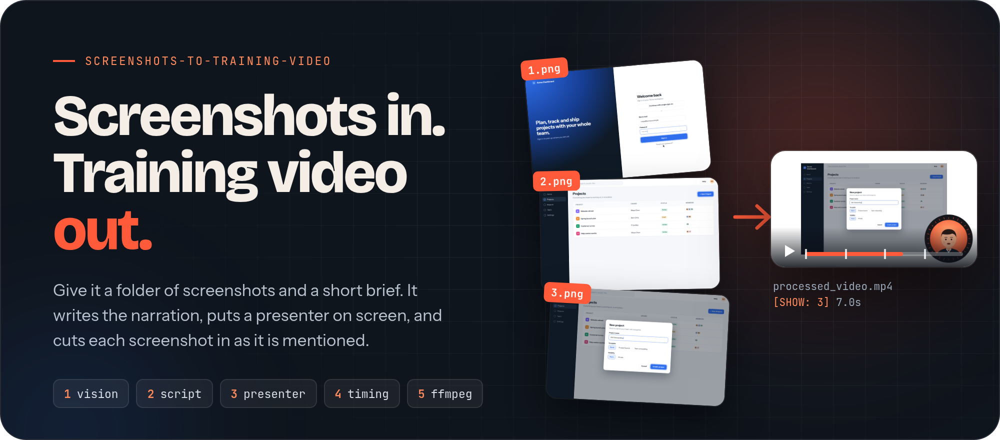
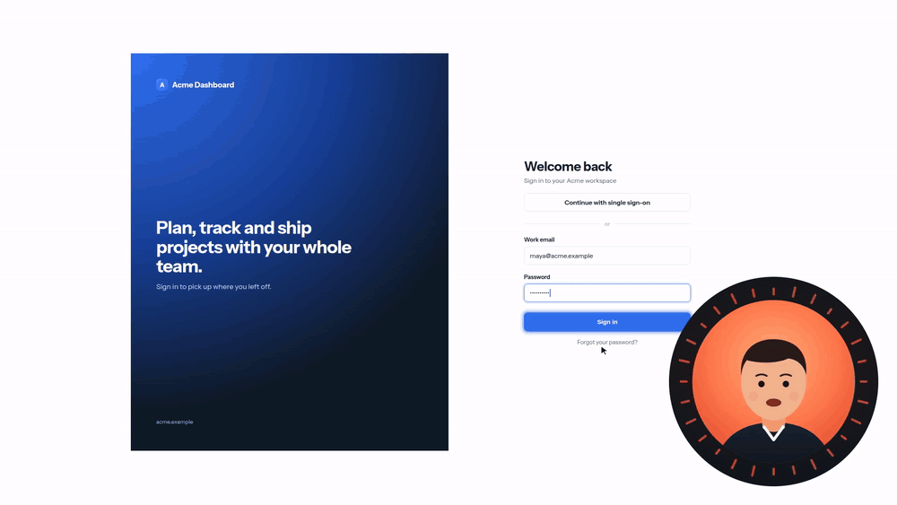
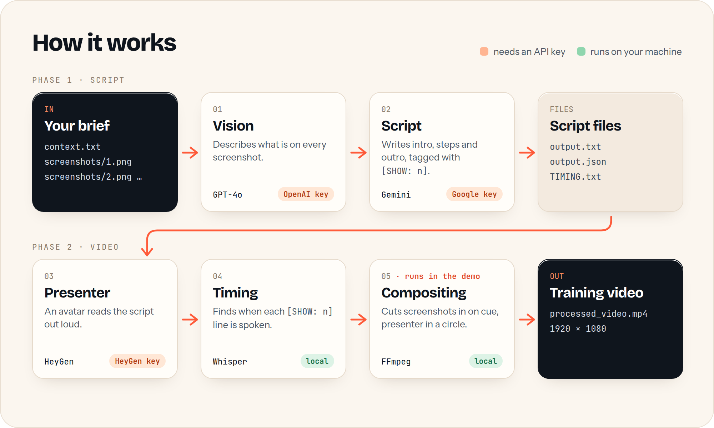
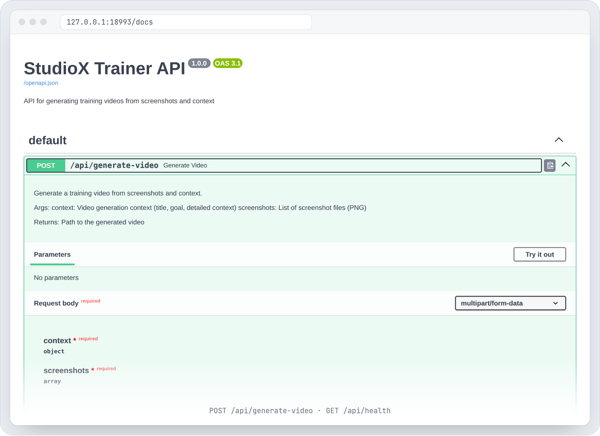

<div align="center">



<br><br>

[](requirements.txt)
[](src/api/main.py)
[](src/processors/video_processor.py)
[](LICENSE)
[](#status-and-limits)

**[Landing page](https://harrythentrepreneur.github.io/screenshots-to-training-video/)** · [How it works](#how-it-works) · [Quick start](#quick-start) · [Try it without keys](#try-the-compositing-stage-without-any-keys) · [Status](#status-and-limits)

</div>

---

Most teams already have screenshots of the software they need to teach. What they lack is the time to write a script, record a voiceover and edit it all together. This project hands that work to a pipeline. Give it a folder of screenshots and a short brief. It describes each screen, writes the narration, has a presenter read it, and cuts each screenshot in at the moment the narration mentions it.

It suits SOPs, product demos and onboarding tutorials. Three guide styles are built in: `TUTORIAL`, `SOP` and `PRODUCT_DEMO`.

## Demo

<div align="center">

</div>

This is real output from the compositing stage in this repo (`src/processors/video_processor.py`), run on the example in [`examples/acme-dashboard`](examples/). The app is made up, and so is the presenter: a silent, animated stand-in for the HeyGen avatar, because the stages before compositing need paid API keys. The four `[SHOW: n]` cues land at 0 s, 3.5 s, 7 s and 10.5 s.

## How it works

<div align="center">

</div>

1. **Vision.** GPT-4o describes what is on each screenshot.
2. **Script.** Gemini writes an intro, the steps and an outro, and tags each line with `[SHOW: n]` for the screenshot it belongs to. The results go to `data/middleware/output.txt`, `output.json` and `TIMING.txt`.
3. **Presenter.** HeyGen renders an avatar reading `output.txt`.
4. **Timing.** Whisper transcribes the presenter video with word timestamps and finds the second each `[SHOW: n]` line starts.
5. **Compositing.** FFmpeg puts each screenshot on a 1920 × 1080 white canvas at its cue and overlays the presenter in a circle, bottom right.

## The API

<div align="center">

</div>

This is a real screenshot of the FastAPI docs page, taken with `uvicorn src.api.main:app` running locally and no keys set. The app starts and serves `/docs` and `/api/health` without keys. `/api/generate-video` needs them.

| Method | Path | What it does |
| --- | --- | --- |
| `POST` | `/api/generate-video` | Multipart: `context` (`title`, `goal`, `detailed_context`, `guide_type`) and `screenshots` (PNG files). Runs the whole pipeline. |
| `GET` | `/api/health` | Returns `{"status": "healthy"}` |

## Quick start

```bash
git clone https://github.com/harrythentrepreneur/screenshots-to-training-video.git
cd screenshots-to-training-video
python -m venv .venv && source .venv/bin/activate
pip install -r requirements.txt
pip install openai-whisper    # the timing stage needs this (see Status)
cp .env.example .env          # then add your keys
```

Put your brief in `data/input/context.txt`. Line 1 is the title, line 2 is the goal, and the rest is detail. Put screenshots in `data/input/screenshots/` as `1.png`, `2.png` and so on.

Start the API:

```bash
uvicorn src.api.main:app --reload
# open http://127.0.0.1:8000/docs
```

Or drive the stages from Python. `src/main.py` holds `ScriptGenerationProcessor` for phase 1, and its `main()` runs phase 2 (timing and compositing) on a presenter video you already have at `data/output/generated_video.mp4`.

### Try the compositing stage without any keys

```bash
python examples/run_compositing.py
# -> data/output/processed_video.mp4  (1920 x 1080, 14 s)
```

This feeds the invented Acme Dashboard screenshots, a hand-written script and cue times, a placeholder presenter clip and a circle mask into the real `VideoProcessor`. It needs only FFmpeg. Details are in [`examples/README.md`](examples/README.md).

## Configuration

| Variable | Used by | Needed for |
| --- | --- | --- |
| `OPENAI_API_KEY` | `src/processors/image_analyzer.py` | Stage 1, screenshot analysis (GPT-4o) |
| `GOOGLE_API_KEY` | `src/generators/script_generator.py` | Stage 2, script writing (Gemini) |
| `HEYGEN_API_KEY` | `src/processors/heygen_processor.py` | Stage 3, presenter video |
| `HEYGEN_AVATAR_ID`, `HEYGEN_VOICE_ID` | `src/processors/heygen_processor.py` | Which avatar and voice HeyGen uses |

FFmpeg must be on your `PATH`. Whisper downloads its model the first time it runs.

## Status and limits

This is an **early prototype**, shared as a working reference rather than a finished tool. Here is what was and was not run for this README:

| Stage | Needs | Run for this README |
| --- | --- | --- |
| 1 Vision | OpenAI key | No |
| 2 Script | Google key | No |
| 3 Presenter | HeyGen key | No |
| 4 Timing | Whisper (local) | No |
| 5 Compositing | FFmpeg (local) | **Yes.** `examples/run_compositing.py` made the demo above |
| API server | nothing | **Yes.** It starts and serves `/docs` and `/api/health` |

Known rough edges:

- `requirements.txt` pins `whisper==1.1.10`, which is a different package on PyPI. Install `openai-whisper` for the timing stage.
- In `src/api/main.py`, the last step of `/api/generate-video` calls `VideoProcessor.process_video()` with older argument names than the method now takes, so a full API run stops at stage 5. The phase-2 path in `src/main.py` (`main()`) calls it correctly.
- Model names are pinned to the versions used during development (`gpt-4o`, `gemini-2.5-pro-preview-03-25`). Change them in `src/processors/image_analyzer.py` and `src/generators/script_generator.py`.
- Compositing reads its mask from `data/middleware/circle_mask.png`. Any white-circle-on-black PNG works. `examples/acme-dashboard/circle_mask.png` is one.

Ideas for later: a web UI, a voice-only mode with no avatar, and more output formats.

## Layout

```
src/api/main.py                    FastAPI app
src/main.py                        Orchestrators (script phase, video phase)
src/processors/image_analyzer.py   Stage 1, vision
src/generators/script_generator.py Stage 2, script
src/processors/heygen_processor.py Stage 3, presenter
src/processors/speech_processor.py Stage 4, timing
src/processors/video_processor.py  Stage 5, compositing
examples/                          Key-free compositing example
assets/                            README art (sources in assets/source)
docs/                              GitHub Pages landing page
```

## License

[MIT](LICENSE) · Built by [Harry Edwards](https://github.com/harrythentrepreneur)
